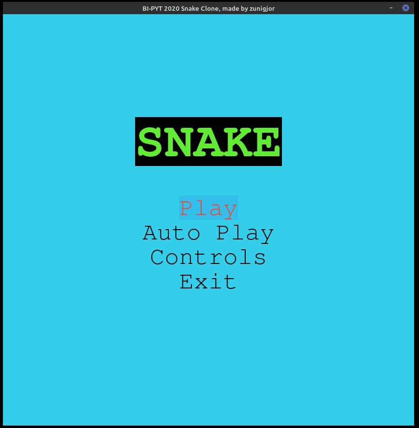

# Welcome to my Snake game clone

This project implements the snake game.

https://en.wikipedia.org/wiki/Snake_(video_game_genre)

## Main features:
+ **A graphical interface**
    + Main menu
    + Controls overview
    + Victory screen
    + Score and high score tracker
+ **Single player gameplay**
    + Simple controls
    + Allows to pause game
    + Tracks high score during single player session
+ **Computer played game**
    + Currently follows a very basic route around the board.
    + Has changeable speed

## How to start the game:
Requires **pygame** and **numpy**.
1. In the terminal open the `src` folder.
2. To run the game type `python snake_game.py`

## Used libraries:
+ **Pygame**
    + Used for drawing textures.
    + Based on SDL.
    + https://www.pygame.org/
+ **numPy**
    + Used in the snake's AI
    + https://numpy.org/

## Future expansion possibilities:
+ **Perfect the AI**
    + Generate a random Hamiltonian cycle on the board **(NP-complete)**
        + Using maze generation and following the path around it
            + Generate maze using Prims or Kruskal algorithm
            + Generate a path that goes around it. (https://codeforces.com/blog/entry/79788)
            + Further described here: https://johnflux.com/2015/05/02/nokia-6110-part-3-algorithms/
        + Using the algorithm described in *“Secondary structures in long compact polymers”* by Richard Oberdorf, Allison Ferguson, Jesper L. Jacobsen and Jané Kondev, Phys. Rev. E 74, 051801 (2006).
    + Allow the snake to skip parts of the Hamiltonian cycle
    
## Preview

